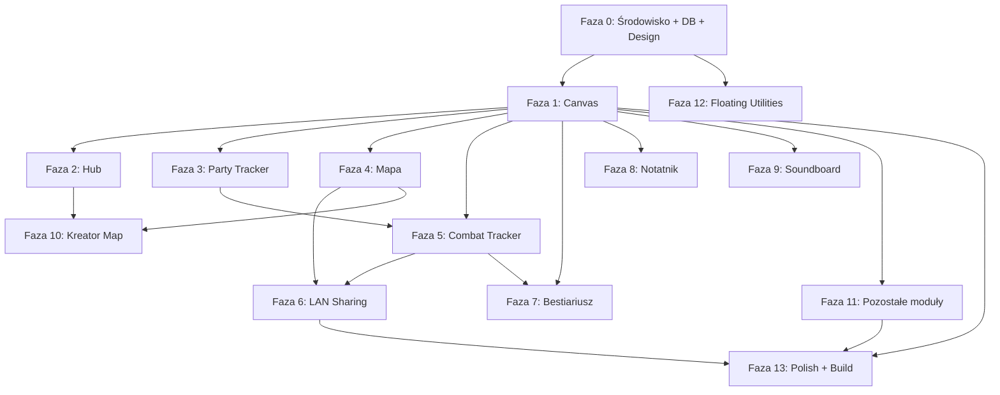

# Game Master Panel - Tutorial krok po kroku

Ten dokument to przewodnik budowania aplikacji Game Master Panel od zera.
AI pełni rolę mentora - prowadzi Cię krok po kroku, a Ty piszesz kod samodzielnie z jego pomocą.

Przed każdą fazą przeprowadzasz brainstorm z AI, aby zaprojektować idealny moduł, a dopiero potem przechodzisz do implementacji.

---

## Wymagania wstępne

Zanim zaczniesz, upewnij się że masz zainstalowane:
- **Node.js** (wersja LTS lub nowsza)
- **npm** lub inny menedżer pakietów
- **Git**
- **Edytor kodu** (np. VS Code, Cursor, WebStorm)
- **AI assistant** (Claude, ChatGPT, lub inny) - będzie Twoim mentorem

---

## Faza 0: Przygotowanie środowiska

### Krok 0.1 - Inicjalizacja projektu

**Dlaczego to robimy:** Potrzebujesz szkieletu aplikacji desktopowej z hot reload, żeby szybko iterować nad kodem.

**Napisz do AI:**
> "Poprowadź mnie krok po kroku jak zainicjalizować projekt Electron + React + TypeScript z Vite. Potrzebuję:
> - electron-builder do budowania na Linux i Windows
> - SQLite (better-sqlite3) jako bazę danych
> - strukturę folderów: src/main (electron), src/renderer (react), src/shared (typy/utils)
> - podstawowy package.json z scriptami dev, build:linux, build:win
> - ESLint + Prettier
>
> Tłumacz mi co robisz na każdym etapie i dlaczego."

**Na co zwrócić uwagę w odpowiedzi AI:**
- Czy AI wyjaśnia dlaczego wybiera dane wersje pakietów
- Czy konfiguracja Vite poprawnie obsługuje Electron (main + renderer)
- Czy hot reload działa zarówno dla renderer jak i main process

**Jak sprawdzić że działa:**
- Uruchom `npm run dev` - powinna otworzyć się pusta aplikacja Electron
- Zmień tekst w renderer - powinien odświeżyć się bez restartu
- Sprawdź w DevTools (Ctrl+Shift+I) czy nie ma błędów w konsoli

**Rezultat:** Działający szkielet Electron + React z hot reload.

### Krok 0.2 - Design System ✅ BRAINSTORM ZAKOŃCZONY

**Dlaczego to robimy:** Ustalamy spójny wygląd aplikacji zanim zaczniemy pisać UI, żeby nie refaktorować później.

**Dokument wymagań:** `docs/brainstorms/2026-05-14-design-system-requirements.md`

**Podjęte decyzje:**

| Aspekt | Decyzja |
|--------|---------|
| Tryb | Dark mode only (brak light mode) |
| Styl | Glassmorphism — nowoczesna baza z subtelnymi magicznymi akcentami w kluczowych interakcjach |
| Kolor akcentowy | Blady złoty / stare złoto (#C9B06B) |
| Font body | Exo 2 (Google Fonts) — geometric sans-serif z tech klimatem |
| Font nagłówków | Michroma (Google Fonts) — uppercase, dashboard/command center feel |
| Font mono | JetBrains Mono / ui-monospace fallback |
| Komponenty | Radix UI (headless primitives) — pełna kontrola nad stylami + accessibility out of the box |
| Stylowanie | CSS Modules (.module.css per komponent) + CSS custom properties jako design tokens |
| Animacje | Umiarkowane — CSS transitions domyślnie, keyframe animations dla kluczowych momentów (bez Framer Motion) |
| Spacing | Skala 4px (4, 8, 12, 16, 20, 24, 32, 40, 48, 64) |

**Paleta kolorów:**
- Tło: `--bg-base: #0F1117`, surface `rgba(255,255,255,0.05)` z `backdrop-blur: 12px`
- Tekst: primary `#E8E6E3`, secondary `#9CA3AF`, muted `#6B7280`
- Accent: `#C9B06B` + warianty (hover, muted, border)
- Semantyczne: success `#4ADE80`, error `#F87171`, warning `#FBBF24`, info `#60A5FA`

**Napisz do AI:**
> "Poprowadź mnie w stworzeniu design systemu na podstawie ustaleń z `docs/brainstorms/2026-05-14-design-system-requirements.md`. Pomóż mi stworzyć:
> - Plik z CSS custom properties (tokeny: kolory, spacing, typography, shadows, blur)
> - Bazowe komponenty z Radix UI + CSS Modules (Button, Input, Card, ToolWindow, Modal)
> - Global styles
>
> Tłumacz każdy krok."

**Na co zwrócić uwagę:**
- Czy kolory mają wystarczający kontrast (dostępność)
- Czy glassmorphism nie będzie problematyczny wydajnościowo przy wielu okienkach
- Czy Radix UI poprawnie obsługuje focus trap i keyboard navigation

**Jak sprawdzić że działa:**
- Stwórz prostą stronę testową z wszystkimi komponentami
- Sprawdź czy glassmorphism wygląda dobrze na ciemnym tle
- Sprawdź czy złoty akcent (#C9B06B) jest czytelny na ciemnym tle
- Sprawdź keyboard navigation (Tab, Escape, Enter) na komponentach Radix

**Rezultat:** Działający design system z tokenami i bazowymi komponentami.

### Krok 0.3 - Baza danych

**Dlaczego to robimy:** Baza danych to fundament - wszystkie moduły będą z niej korzystać.

**Brainstorm z AI:**
> "Porozmawiaj ze mną o schemacie bazy danych SQLite dla aplikacji Game Master Panel. Oto moduły które będę budować:
> - Kampanie (z wizardem tworzenia)
> - Postacie graczy (Party Tracker)
> - Mapy (globalna biblioteka)
> - Potwory (Bestiariusz)
> - NPC (biblioteka + generator)
> - Notatki (block editor)
> - Audio (soundboard)
> - Sesje (śledzenie sesji gry)
> - Ustawienia kampanii (custom kalendarze, warunki walki, itp. - pole settings_json)
>
> Omówmy:
> - Jakie tabele potrzebuję
> - Jakie relacje między nimi
> - Jak przechowywać elastyczne dane (JSON fields vs osobne tabele)
> - Strategia migracji
> - Jak zorganizować IPC między main process a rendererem
>
> Dopytaj mnie o szczegóły."

**Napisz do AI:**
> "Poprowadź mnie krok po kroku w implementacji modułu bazy danych na podstawie naszych ustaleń. Potrzebuję:
> - Definicje tabel z migracjami
> - Helper functions do CRUD
> - IPC handlers w main process
> - Preload script z bezpiecznym API dla renderera
>
> Tłumacz każdy krok i dlaczego tak a nie inaczej."

**Na co zwrócić uwagę:**
- Czy AI używa prepared statements (bezpieczeństwo)
- Czy IPC jest typowane (TypeScript interfaces w src/shared)
- Czy migracje są wersjonowane

**Jak sprawdzić że działa:**
- Stwórz testową kampanię przez IPC z renderera
- Sprawdź czy dane zapisują się w pliku .db
- Zrestartuj aplikację i sprawdź czy dane przetrwały

**Rezultat:** Działająca baza danych z API dostępnym z frontendu.

### Krok 0.4 - Strategia autozapisu

**Dlaczego to robimy:** Każdy moduł będzie potrzebował autozapisu - lepiej ustalić strategię raz niż wymyślać za każdym razem.

**Brainstorm z AI:**
> "Porozmawiaj ze mną o strategii autozapisu danych w aplikacji Electron + SQLite. Omówmy:
> - Kiedy zapisywać (debounce, natychmiast, przy zamknięciu okna?)
> - Jak obsłużyć konflikty (wiele okienek edytuje te same dane?)
> - Jak sygnalizować użytkownikowi stan zapisu
> - Jak obsłużyć błędy zapisu
> - Performance - jak nie blokować UI przy zapisie
>
> Dopytaj mnie o szczegóły."

**Rezultat:** Ustalona strategia autozapisu używana przez wszystkie moduły.

### Krok 0.5 - State management

**Brainstorm z AI:**
> "Porozmawiaj ze mną o wyborze state management dla mojego projektu:
>
> Porównaj opcje dla aplikacji z wieloma niezależnymi oknami na canvasie:
> - Zustand
> - Redux Toolkit
> - Jotai
> - React Context
>
> Uwzględnij: wydajność z wieloma okienkami na canvasie, łatwość nauki (junior developer), integrację z TypeScript.
>
> Framework CSS i biblioteka komponentów już wybrane: CSS Modules + Radix UI (patrz Krok 0.2).
>
> Dopytaj mnie o preferencje."

**Rezultat:** Wybrany i skonfigurowany state management.

---

## Faza 1: Nieskończone płótno (Canvas)✅ ZAKOŃCZONE

### Krok 1.0 - Brainstorm✅ ZAKOŃCZONE

**Napisz do AI:**
> "Porozmawiaj ze mną o implementacji infinite canvas dla mojej aplikacji. To KLUCZOWY komponent - od niego zależy cała reszta. Omówmy:
> - Jaka biblioteka najlepsza (react-flow, pixi.js, custom canvas z react-dnd, inne?)
> - Nieskończone płótno z zoom i pan
> - System okienek: drag, resize, minimize, close, z-order, pin (always on top)
> - Context menu z narzędziami pogrupowanymi w kategorie (Combat Tools, NPC Management, World & Time, Tables & Content, Audio/Visual)
> - Wiele instancji tego samego narzędzia
> - Minimapa w rogu
> - Konfigurowalne tło (ciemne/siatka kropek/siatka linii)
> - Animacje: płynne otwieranie/zamykanie/minimalizowanie okienek
> - Autozapis stanu canvasa (pozycje okienek, zoom, pan) do SQLite per kampania
> - Wydajność z 10+ oknami otwartymi jednocześnie
> - Wymogi: R5-R9, R63-R67 z docs/brainstorms/2026-05-13-game-master-panel-requirements.md
>
> Dopytaj mnie o priorytety i edge case'y."

### Krok 1.1 - Implementacja silnika płótna✅ ZAKOŃCZONE

**Napisz do AI:**
> "Na podstawie naszych ustaleń, poprowadź mnie krok po kroku w implementacji infinite canvas z [wybrana biblioteka]. Zaczynamy od podstaw i budujemy stopniowo. Tłumacz każdy krok."

**Na co zwrócić uwagę:**
- Czy zoom działa płynnie (nie szarpie)
- Czy pan działa na middle mouse + alt+drag
- Czy okienka nie migają przy szybkim przesuwaniu

**Jak sprawdzić że działa:**
- Otwórz 5+ pustych okienek z context menu
- Przesuwaj je, zmieniaj rozmiar, minimalizuj
- Zoomuj i panuj - okienka powinny się przesuwać razem z canvasem
- Zamknij i otwórz ponownie aplikację - układ powinien się zachować

**Rezultat:** Działające płótno z systemem okienek.

### Krok 1.2 - Skróty klawiszowe✅ ZAKOŃCZONE

**Dlaczego to robimy:** Power userzy potrzebują skrótów do szybkiej nawigacji.

**Napisz do AI:**
> "Poprowadź mnie w dodaniu systemu skrótów klawiszowych do canvasa:
> - Ctrl+Z / Ctrl+Y: globalny undo/redo
> - Ctrl+= / Ctrl+-: zoom in/out
> - Ctrl+0: reset zoom
> - Escape: zamknij aktywne okno/dialog
> - Space+drag: pan (alternatywa)
> - Wyświetl listę skrótów pod Ctrl+?
>
> Pokaż mi jak zrobić to w sposób rozszerzalny (łatwo dodawać nowe skróty)."

**Jak sprawdzić że działa:**
- Przetestuj każdy skrót
- Sprawdź czy Escape zamyka okno na pierwszym planie
- Sprawdź czy Ctrl+? pokazuje listę

**Rezultat:** Pełna nawigacja klawiaturą.

### Krok 1.3 - Globalny Undo/Redo✅ ZAKOŃCZONE

**Napisz do AI:**

> "Poprowadź mnie w implementacji globalnego systemu undo/redo:
> - Stos akcji z opisem (np. 'Przesunięto okienko', 'Zmieniono HP')
> - Ctrl+Z cofa ostatnią akcję, Ctrl+Y powtarza
> - Każdy moduł rejestruje swoje akcje w centralnym storze
> - Limit stosu: ostatnie 50 akcji
>
> Pokaż mi wzorzec który pozwoli łatwo dodawać undo/redo do nowych modułów."

**Jak sprawdzić że działa:**
- Przesuń okienko, Ctrl+Z - wraca na miejsce
- Ctrl+Y - przesuwa ponownie
- Sprawdź limit 50 akcji

**Rezultat:** Działający undo/redo.

### Krok 1.4 - Focus Presets ✅ ZAKOŃCZONE

**Dlaczego to robimy:** Gracz Mistrz używa różnych layoutów w różnych sytuacjach (walka vs eksploracja vs roleplay).

**Brainstorm z AI:**

> "Porozmawiaj ze mną o Focus Presets - zapisywaniu i przywracaniu layoutów okienek. Omówmy:
> - Jak zapisywać układ (pozycje, rozmiary, zoom, które okienka otwarte)
> - Jak przełączać między layoutami (animacja? natychmiastowo?)
> - Gdzie w UI umieścić zarządzanie presetami (context menu? osobny panel?)
> - Czy automatycznie zapisywać 'Last Setup'?
> - Ile presetów maximum?
>
> Dopytaj mnie o szczegóły."

**Napisz do AI:**

> "Poprowadź mnie w implementacji Focus Presets na podstawie naszych ustaleń."

**Jak sprawdzić że działa:**

- Ułóż okienka, zapisz preset "Walka"
- Zmień układ, zapisz "Eksploracja"
- Przełączaj między nimi - układ powinien się odtwarzać
- Zrestartuj aplikację - presety powinny przetrwać

**Rezultat:** Działające Focus Presets.

---

## Faza 2: Menu wejściowe (Hub)

### Krok 2.0 - Brainstorm

**Napisz do AI:**

> "Porozmawiaj ze mną o ekranie startowym (Hub) aplikacji. Omówmy:
> - Layout: jak wyglądać ma główny ekran
> - Lista kampanii: jakie informacje wyświetlać (nazwa, system, ikona, data ostatniej sesji)
> - Campaign Wizard: wieloetapowe tworzenie kampanii (nazwa+system+ikona → pola postaci → członkowie drużyny → statystyki walki)
> - Demo Campaign: predefiniowana kampania dla nowych użytkowników
> - Przejście do canvasa: jaka animacja
> - Kreator Map: osobny widok dostępny z Huba
> - Użyj wymagań R10, R11, R54, R55, R68 z docs/brainstorms/2026-05-13-game-master-panel-requirements.md
>
> Dopytaj mnie o szczegóły wizualne i funkcjonalne."

### Krok 2.1 - Implementacja Huba

**Napisz do AI:**

> "Poprowadź mnie krok po kroku w implementacji ekranu startowego na podstawie naszych ustaleń. Zaczynamy od layoutu, potem lista kampanii, potem wizard."

**Na co zwrócić uwagę:**

- Czy glassmorphism dobrze wygląda na ekranie startowym
- Czy Campaign Wizard jest intuicyjny (kolejne kroki logicznie się łączą)
- Czy animacja przejścia Hub → Canvas jest płynna

**Jak sprawdzić że działa:**

- Otwórz aplikację - Hub powinien się wyświetlić
- Stwórz nową kampanię przez wizard (wszystkie kroki)
- Kliknij kampanię - przejście do canvasa
- Wróć do Huba i sprawdź czy kampania jest na liście
- Sprawdź czy Demo Campaign istnieje przy pierwszym uruchomieniu

**Rezultat:** Działający hub z listą kampanii i Campaign Wizard.

---

## Faza 3: Party Tracker ✅ ZAKOŃCZONE

### Krok 3.0 - Brainstorm (ustalenia) ✅ ZAKOŃCZONE

**Ustalenia z brainstormu:**

**Okienko Party Tracker:**

- Window na infinite canvas (przesuwalne, resizable jak inne okna)
- Karty postaci ułożone w rzędzie z flex-wrap (zawijanie do kolejnych wierszy)
- Rozmiar kart: presety S / M / L (w ustawieniach gear menu)
- Przycisk "+" na końcu rzędu kart — dodaje nową pustą postać
- Drag&drop kart zmienia kolejność postaci w party
- Gear icon (prawy górny róg): edytuj strukturę kart, usuń postać, preset rozmiaru

**Karta postaci:**
- Zdjęcie postaci (góra, wycentrowane) — klik na placeholder otwiera file picker
- Nazwa postaci (pod zdjęciem) — double-click włącza inline edit
- Custom pola poniżej — wartości edytowane inline (klik → edycja)
- Domyślne pola nowej kampanii: HP, Armor, Initiative — ale usuwalne jak każde inne

**Edytor struktury kart (Card Editor):**
- Otwierany z gear menu jako modal overlay nad canvasem
- Dwie kolumny: lewa = podgląd na żywo karty, prawa = lista pól do edycji
- Struktura wspólna dla WSZYSTKICH postaci w kampanii
- Pola ułożone pionowo, kolejność zmieniana drag&drop
- Dodawanie pola: wybór typu (Number, Bubbles, Text Field, Text Box, Radio, Checkbox)
- Każde pole ma: tytuł, szerokość (1/3, 1/2, 2/3, full), text-align (L/C/R), pozycja w wierszu (L/C/R)
- Auto-flow: pola o łącznej szerokości ≤ 1 stają obok siebie w jednym wierszu
- Ustawienia per typ:
  - Number: opcja suwaka (jeśli włączony — wymagane min i max)
  - Bubbles: ilość kółek (stała, user zaznacza wypełnione)
  - Radio: lista opcji (etykiety)
  - Text Field / Text Box / Checkbox: brak dodatkowych
- Przyciski Cancel i Save na dole

**Persystencja i integracja:**
- SQLite per kampania (dane postaci + struktura kart + zdjęcia)
- Combat Tracker współdzieli dane postaci (HP, Initiative itp.)

### Krok 3.1 - Karty postaci ✅ ZAKOŃCZONE

**Napisz do AI:**
> "Poprowadź mnie w implementacji Party Trackera jako okienka na canvasie. Zaczynamy od wyświetlania kart z flex-wrap, potem edycja inline. Użyj ustaleń z brainstormu w tutorialu (Krok 3.0)."

**Na co zwrócić uwagę:**
- Czy karty wyglądają dobrze z glassmorphism
- Czy edycja inline jest intuicyjna (klik na wartość → edycja)
- Czy flex-wrap działa poprawnie przy wielu kartach
- Czy presety rozmiaru (S/M/L) zmieniają karty

**Jak sprawdzić że działa:**
- Otwórz Party Tracker z context menu
- Dodaj 4+ postaci przyciskiem "+"
- Ustaw zdjęcia (klik na placeholder → file picker)
- Double-click na nazwę → zmień nazwę
- Edytuj HP/Armor kliknięciem na wartość
- Drag&drop zmień kolejność kart
- Zmień preset rozmiaru w gear menu
- Zmień rozmiar okienka - karty powinny się zawijać (flex-wrap)
- Zamknij i otwórz ponownie - dane powinny przetrwać (SQLite)

### Krok 3.2 - Edytor karty postaci ✅ ZAKOŃCZONE

**Napisz do AI:**
> "Poprowadź mnie w implementacji edytora karty postaci (Card Editor) jako modal overlay. Dwie kolumny: live preview + lista pól. Użyj ustaleń z brainstormu w tutorialu (Krok 3.0)."

**Jak sprawdzić że działa:**
- Otwórz edytor z gear menu
- Dodaj różne typy pól (Number z suwakiem, Bubbles, Text, Radio)
- Drag&drop zmień kolejność pól - preview aktualizuje się na żywo
- Ustaw szerokości (1/3, 1/2) — pola stają obok siebie (auto-flow)
- Ustaw text-align i pozycję w wierszu
- Zapisz → karta wygląda jak w preview
- Cancel → cofa wszystkie zmiany
- Sprawdź że struktura działa na WSZYSTKIE postacie

**Rezultat:** Pełny Party Tracker z edytorem kart.

**Integracje z innymi modułami:**
- → Combat Tracker: współdzielone dane postaci (HP, Initiative)
- → Mapa: postaci jako tokeny na mapie
- → LAN Sharing: karty widoczne dla graczy (konfigurowalne co widać)

---

## Faza 4: Mapa rozgrywki ✅ ZAKOŃCZONE

### Krok 4.0 - Brainstorm (ustalenia) ✅ BRAINSTORM ZAKOŃCZONY

**Dokument wymagań:** `docs/brainstorms/2026-05-14-map-display-requirements.md`

**Podjęte decyzje:**

**Renderer i architektura warstw:**
- Pixi.js (WebGL) — wydajność + elastyczność, natywne wsparcie layerów, filtrów, animacji
- Stos warstw (od dołu): Obraz tła → Siatka → Tokeny → Fog of War → UI overlay
- Mapa to statyczny obraz ładowany z globalnej biblioteki map (osobny moduł, poza scope)
- Fallback: systemowy file picker (Electron dialog) dopóki biblioteka map nie istnieje

**Siatka:**
- Typy: kwadratowa, heksagonalna, brak — konfigurowalny rozmiar komórki i opacity
- Siatka czysto wizualna — brak snap-to-grid, tokeny pozycjonowane swobodnie

**Fog of War:**
- Dwa osobne narzędzia: "Reveal" (odsłanianie) i "Conceal" (zakrywanie)
- Każde z regulowanym rozmiarem pędzla i przezroczystością (100%/50%/0%)
- Tylko freehand brush (bez cell brush) — FoW niezależny od siatki
- Bulk actions: "Odsłoń całą mapę" / "Zakryj całą mapę"
- Zapis: hybryda — PNG blob w SQLite (trwały) + stroke buffer w pamięci (undo/redo w sesji)

**Tokeny:**
- Drag&drop z paneli Party Tracker i Bestiariusz
- Wygląd: okrągły avatar (obrazek postaci/potwora), fallback na kolorowe koło z inicjałami, nazwa pod tokenem
- Swobodne przesuwanie (bez snap-to-grid)
- Integracja z Combat Trackerem — ładowanie uczestników walki jako tokeny (R26)

**Toolbar (pełny panel kontrolny):**
- Przełączanie trybów: Nawigacja, Pędzel FoW (Reveal/Conceal), Tokeny, Efekty VFX
- Aktywne narzędzie blokuje domyślne zachowanie canvasa
- Panel ustawień aktywnego narzędzia (rozmiar, styl, opacity, parametry specyficzne)

**Efekty VFX:**
- Preset library z 5-10 gotowymi efektami (ogień, eksplozja, mgła, błyskawica, dym, światło)
- GM umieszcza efekt w wybranym punkcie na mapie
- Konfiguracja per efekt: tryb (one-shot/persistent), opóźnienie/trigger manualny, rozmiar, czas trwania

**Nawigacja:**
- Tryb nawigacji: scroll = zoom, drag = pan (wewnątrz okienka mapy)

**Zapis stanu w SQLite:**
- Ścieżka do obrazka, konfiguracja siatki (JSON), pozycje tokenów (JSON), maska FoW (PNG blob)

### Krok 4.1 - Implementacja mapy ✅ ZAKOŃCZONE

**Status implementacji (2026-05-15):**

Zrealizowane kroki:
- ✅ **Pixi.js v8 bootstrap** — `usePixiApp.ts` z async `init()`, race condition fix (destroyed flag), ResizeObserver auto-resize
- ✅ **Ładowanie obrazka mapy** — IPC: main process czyta plik → base64 data URL → Pixi.js Sprite (Chromium blokuje `file://`)
- ✅ **Zoom/Pan** — zoom buttons + slider + percentage + fit-to-window (floating overlay); pan via middle mouse drag; scroll wheel zablokowany
- ✅ **Grid overlay** — `useGridLayer.ts`: square + hex grid via Pixi.js Graphics, z kontrolkami (type, cellSize, opacity)
- ✅ **Fog of War** — `useFowLayer.ts`: mask-based approach (RenderTexture jako maska na czarnym reccie), reveal/conceal pędzlem, Reveal All / Conceal All buttony, debounced PNG persistence
- ✅ **GIMP-style toolbar** — icon grid (góra) + context panel (środek) + grid settings (dół via `margin-top: auto`)
- ✅ **noPadding ToolWindow** — pełne pokrycie canvas bez paddingu, `FULL_BLEED_TOOLS` w CanvasWindow
- ✅ **Intuitive icons** — navigate (crosshair arrows), reveal (eye open), conceal (eye slash), load map (landscape), tokens (person), vfx (star)
- ✅ **Token system** — `useTokenLayer.ts`: circular tokens z avatarem lub inicjałami, name label, drag na mapie (navigate/tokens tool), kolorowanie po nazwie
- ✅ **Cross-tool drag&drop** — Party Tracker → Map: `dragstart` ustawia `application/json` z danymi postaci, MapDisplay `onDrop` tworzy `MapToken`
- ✅ **Manual tokens** — przycisk "Add Token" w kontekście narzędzia Tokens, lista tokenów z opcją usuwania
- ✅ **VFX effects** — `useVfxLayer.ts`: 7 presetów (fire, explosion, smoke, lightning, glow, fog, ice), particle system z Graphics, click-to-place, configurable size/mode/duration, one-shot auto-remove
- ✅ **State persistence** — cały `MapDisplayState` (w tym tokeny, VFX, FoW data URL) persystowany przez istniejący mechanizm canvas state JSON blob → SQLite

Odkrycia techniczne:
1. Pixi.js v8 `init()` jest async — strict mode React 19 wymaga `destroyed` flag
2. Chromium blokuje `file://` — trzeba IPC + base64 data URL
3. `'erase'` blend mode NIE DZIAŁA z `renderer.render()` na RenderTexture w Pixi v8 — rozwiązanie: mask-based FoW (biały=fog widoczny, czarny=odsłonięty)
4. Kontener DOM może mieć wymiary 0 podczas async init — ResizeObserver naprawia to
5. HTML5 DnD `dataTransfer.setData('application/json', ...)` działa jako cross-tool communication między React components a Pixi canvas
6. **React StrictMode + async guard deadlock:** Jeśli useEffect uruchamia async operację chronioną `loadingRef.current` (guard zapobiegający podwójnemu wywołaniu), StrictMode powoduje deadlock: 1. pierwszy run ustawia guard=true i startuje async, 2. cleanup ustawia cancelled=true, 3. drugi run widzi guard=true → zablokowany, 4. pierwszy async widzi cancelled=true → nic nie robi. **Fix:** W cleanup efektu resetuj `loadingRef.current = false` żeby drugi run mógł kontynuować.
7. **patchState pattern** — `useCallback((patch: Partial<State>) => onToolStateChange({...current, ...patch}))` z `stateRef` + `useLayoutEffect` zapobiega utracie pól stanu (np. imagePath) przez stale closures
8. **Persistence readyRef guard** — `useCanvasPersistence` używa `readyRef` żeby nie zapisywać pustego stanu przed zakończeniem loadowania z SQLite

**Pixi.js → Canvas 2D rewrite (2026-05-15):**
Mapa została przepisana z Pixi.js WebGL na natywny HTML Canvas 2D API. Powody: uproszczenie architektury, mniejszy bundle, brak problemów z WebGL context loss. Hooki zostały przepisane:
- `useCanvasRenderer.ts` — render loop z requestAnimationFrame, viewport transform, background image
- `useTokenRenderer.ts` — rysowanie tokenów (arc + clip + drawImage), drag, `TOKEN_RADIUS = 24`
- `useFowRenderer.ts` — Fog of War na offscreen canvas (compositing operations)
- `useVfxRenderer.ts` — particle effects rysowane na canvas 2D

Dodatkowe funkcje (2026-05-15):
- ✅ **Per-token scale slider** — suwak 0.5×–3.0× w panelu Tokens, zmienia `MapToken.scale`
- ✅ **Cursor preview circle** — dashed white circle pod kursorem dla narzędzi VFX, Tokens, FoW (reveal/conceal)
- ✅ **Map image persistence fix** — readyRef guard + loadingRef StrictMode deadlock fix

Pliki modułu:
- `src/ui/tools/map-display/MapDisplay.tsx` — główny komponent z toolbar + canvas
- `src/ui/tools/map-display/MapDisplay.module.css` — style
- `src/ui/tools/map-display/types.ts` — interfejsy + DEFAULT_MAP_STATE
- `src/ui/tools/map-display/hooks/useCanvasRenderer.ts` — render loop, viewport, background
- `src/ui/tools/map-display/hooks/useTokenRenderer.ts` — token rendering + drag
- `src/ui/tools/map-display/hooks/useFowRenderer.ts` — Fog of War
- `src/ui/tools/map-display/hooks/useVfxRenderer.ts` — VFX particle system
- `src/ui/tools/map-display/hooks/useGridRenderer.ts` — grid overlay (square + hex)

**Jak sprawdzić że działa:**
- Załaduj mapę — obraz wyświetla się z zoom/pan
- Włącz siatkę kwadratową i hex — poprawne nakładanie
- Odsłoń/zakryj FoW pędzlem, użyj Reveal All / Conceal All
- Przeciągnij postać z Party Trackera na mapę — token z avatarem
- Dodaj manual token, przeciągnij go po mapie
- Dodaj efekt VFX (ogień, eksplozja, itp.) — kliknij na mapie
- Zamknij i otwórz mapę — stan powinien się zachować

**Rezultat:** Działająca mapa z FoW i tokenami.

**Integracje z innymi modułami:**
- ← Party Tracker: postaci jako tokeny (drag&drop)
- ← Bestiariusz: potwory jako tokeny (drag&drop)
- → Combat Tracker: przycisk "Załaduj na mapę" dodaje uczestników walki
- → LAN Sharing: mapa widoczna dla graczy (bez FoW które DM nie odsłonił)

---

## Faza 5: Combat Tracker  ✅ ZAKOŃCZONE

### Krok 5.0 - Brainstorm  ✅ ZAKOŃCZONE

**Napisz do AI:**
> "Porozmawiaj ze mną o Combat Tracker - narzędziu do prowadzenia walki. Omówmy:
> - Lista uczestników w kolejności inicjatywy
> - Jakie informacje wyświetlać (portret, nazwa, HP, inicjatywa, warunki/statusy)
> - System tur: podświetlenie aktywnego, przycisk 'Następna tura'
> - Dodawanie uczestników: drag&drop z Party Trackera, z Bestiariusza, ręcznie
> - Damage/Heal: jak szybko modyfikować HP
> - Warunki/statusy: lista checkboxów (Stunned, Poisoned, itp.) - konfigurowalne per kampania
> - Rzut inicjatywy: automatyczny przycisk
> - Integracja z mapą: przycisk 'Załaduj na mapę'
> - Wizualne wskazanie HP = 0 (czerwona karta)
> - Sprawdź inspiracja/combat tracker.md jako referencję
> - Użyj wymagań R27-R31
>
> Dopytaj mnie o szczegóły flow walki."

### Krok 5.1 - Implementacja  ✅ ZAKOŃCZONE

**Napisz do AI:**
> "Poprowadź mnie w implementacji Combat Trackera na podstawie naszych ustaleń. Zaczynamy od listy uczestników, potem system tur, potem damage/heal."

**Na co zwrócić uwagę:**
- Czy przełączanie tur jest szybkie i czytelne
- Czy drag&drop dodawania uczestników jest intuicyjne
- Czy wizualnie odróżniasz aktywnego uczestnika od reszty

**Jak sprawdzić że działa:**
- Dodaj 5+ uczestników (mix z Party Trackera i ręcznie)
- Rzuć inicjatywę - kolejność powinna się posortować
- Przełączaj tury - podświetlenie powinno się przesuwać
- Zadaj damage - HP powinno się zmniejszyć
- Ustaw HP na 0 - karta powinna być czerwona
- Dodaj warunki (Stunned, Poisoned) - powinny być widoczne na karcie

**Rezultat:** Działający combat tracker.

**Integracje z innymi modułami:**
- ← Party Tracker: postaci jako uczestnicy walki (drag&drop)
- ← Bestiariusz: potwory jako uczestnicy (drag&drop)
- → Mapa: przycisk "Załaduj na mapę" tworzy tokeny dla wszystkich
- → LAN Sharing: kolejność inicjatywy widoczna dla graczy

---

## Faza 6: Udostępnianie LAN (Killer Feature)  ✅ ZAKOŃCZONE

### Krok 6.0 - Brainstorm  ✅ ZAKOŃCZONE

**Napisz do AI:**
> "Porozmawiaj ze mną o systemie LAN sharing - to kluczowa funkcja mojej aplikacji. Omówmy:
> - Architektura: lokalny HTTP server + WebSocket w Electron
> - Jaką technologię (express + socket.io, fastify + ws, uWebSockets?)
> - Co gracze widzą w przeglądarce: mapa, inicjatywa, statystyki postaci
> - Co gracze mogą robić: przesuwać swój token? edytować swoje pola?
> - DM kontroluje co jest widoczne i interaktywne (checkboxy/toggles)
> - Czy dźwięk z Soundboarda streamować do graczy?
> - Podgląd 'Widok Gracza' na canvasie DM-a
> - Bezpieczeństwo: czy gracze mogą coś zepsuć?
> - Synchronizacja w czasie rzeczywistym
> - Responsywny interfejs dla graczy (mobile/tablet/desktop)
> - Użyj wymagań R49-R52
>
> Dopytaj mnie o każdy aspekt."

### Krok 6.1 - Implementacja serwera  ✅ ZAKOŃCZONE

**Napisz do AI:**
> "Poprowadź mnie krok po kroku w implementacji LAN sharing. Zaczynamy od serwera HTTP + WebSocket, potem prosty widok gracza, potem synchronizacja."

**Na co zwrócić uwagę:**
- Czy serwer startuje na konfigurowalnym porcie
- Czy WebSocket reconnect działa gdy gracz straci połączenie
- Czy zmiany DM-a są natychmiastowe u graczy

**Jak sprawdzić że działa:**
- Uruchom aplikację i serwer LAN
- Otwórz URL w przeglądarce na tym samym komputerze
- Otwórz URL na telefonie (ten sam WiFi)
- Przesuń token na mapie - powinien się ruszyć u gracza
- Odsłoń FoW - gracz powinien zobaczyć nowy fragment
- Wyłącz widoczność mapy w ustawieniach - gracz nie powinien jej widzieć

**Rezultat:** Gracze widzą mapę i info na swoich urządzeniach.

**Integracje z innymi modułami:**
- ← Mapa: widok mapy dla graczy (bez ukrytego FoW)
- ← Combat Tracker: kolejność inicjatywy dla graczy
- ← Party Tracker: statystyki postaci gracza
- ← Soundboard: opcjonalny streaming audio

---

## Faza 7: Bestiariusz ✅ BRAINSTORM ZAKOŃCZONY

### Krok 7.0 - Brainstorm ✅ ZAKOŃCZONE

**Dokument wymagań:** `docs/brainstorms/2026-05-15-bestiary-requirements.md`
**Plan implementacji:** `docs/plans/2026-05-15-008-feat-bestiary-creature-library-encounter-sets-plan.md`

**Podjęte decyzje:**

| Aspekt | Decyzja |
|--------|---------|
| Architektura | Dwu-panelowy layout: Library (lista+search) / Sets (drzewko) + prawy panel szczegółów |
| Dane | Szablon (template) + instancja (instance) z lazy propagation |
| Propagacja | Instancja przechowuje tylko nadpisane pola; render merguje template + overrides |
| Hierarchia | Adjacency list (parent_id) w SQLite, drzewko budowane w JS |
| Głębokość | Nieograniczona (user decyduje o strukturze) |
| Statystyki | D&D 5e (HP, AC, abilities, CR, speed, actions, traits) + custom fields (klucz-wartość) |
| CR | Przechowywany jako TEXT (obsługa frakcji: "1/4", "1/2") |
| Akcje/Ataki | Hybrid — strukturyzowane (nazwa, to-hit, damage) z opcją free-text |
| Wymagane pola | Tylko nazwa — reszta opcjonalna |
| Awatar | Custom image upload + fallback na emoji typu (🐻 beast, 💀 undead, 🧑 humanoid) |
| Kolorowanie | Auto kolor wg CR w drzewku (zielony/żółty/czerwony) |
| Usuwanie szablonu | Osierocenie instancji (ON DELETE SET NULL) — zachowują dane, tracą link |
| Tworzenie folderów | Context menu (prawy klik) |
| Dodawanie do zestawu | Drag z biblioteki do folderu w drzewku |
| Reorganizacja | Drag & drop wewnątrz drzewka |
| Integracja z mapą | Drag & drop instancji → MapDropPayload (type: 'bestiary-creature') |
| Scope globalny | Jedna biblioteka na aplikację (nie per kampania) |
| Masowe operacje | Brak na start |
| Import | Brak na start (tylko ręczne tworzenie) |

**Fazy implementacji:**
1. Foundation — schemat SQLite, typy, IPC CRUD
2. UI Shell — dual-panel layout, LibraryPanel, CreatureForm
3. Encounter Tree — drzewko, context menu, drag reorder, CR kolory
4. Cross-Tool DnD — drag instancji na mapę / combat tracker

### Krok 7.1 - Implementacja  ✅ ZAKOŃCZONE

**Napisz do AI:**
> "Zaimplementuj Bestiariusz wg planu `docs/plans/2026-05-15-008-feat-bestiary-creature-library-encounter-sets-plan.md`. Zacznij od Phase 1."

**Jak sprawdzić że działa:**
- Stwórz stworzenie z samą nazwą — powinno się zapisać
- Dodaj pełne statystyki (HP, AC, abilities, actions) — formularz sekcjami
- Wyszukaj po nazwie i tagach — filtrowanie działa
- Stwórz hierarchię folderów (3+ poziomy) — context menu, drzewko się rozwija
- Przeciągnij stworzenie z biblioteki do folderu — instancja powstaje
- Edytuj szablon — zmiana propaguje się do instancji
- Nadpisz pole w instancji — edycja szablonu nie nadpisuje tego pola
- Usuń szablon — instancje zostają z danymi (osierocone)
- Drag & drop instancji na mapę — token się pojawia
- Reorganizuj drzewko drag & drop — foldery i instancje się przesuwają

**Rezultat:** Działający bestiariusz z biblioteką szablonów i zestawami encounters.

**Integracje z innymi modułami:**
- → Mapa: instancje jako tokeny (drag & drop, `MapDropPayload`)
- → Combat Tracker: instancje jako uczestnicy walki (drag & drop, gdy CT będzie gotowy)

### Krok 7.2 - Redesign formularza bestii ✅ LAYOUT ZAKOŃCZONY

**Dokumenty:**

- Wymagania layoutu: `docs/brainstorms/2026-05-17-bestiary-form-redesign-requirements.md`
- Plan layoutu: `docs/plans/2026-05-17-002-feat-bestiary-form-two-column-redesign-plan.md`
- Wymagania field types: `docs/brainstorms/2026-05-17-bestiary-field-types-config-requirements.md`

**Podjęte decyzje (layout):**

| Aspekt | Decyzja |
|--------|---------|
| Layout | Dwie kolumny 40/60 zamiast jednokolumnowego z collapse |
| Sticky header | Nazwa + Type + Size + CR + Alignment zawsze widoczne na górze |
| Lewa kolumna | Combat, Ability Scores, Skills, Defenses, Senses & Languages, Info |
| Prawa kolumna | Traits, Actions, Bonus Actions, Reactions, Legendary Actions |
| Collapse | Usunięty — sekcje zawsze widoczne |
| Sekcje puste | Wyświetlane normalnie (nie ukrywane) |
| Migracja | Stare struktury bez `column` property resetowane do domyślnych |

**Podjęte decyzje (field types — do implementacji):**

| Aspekt | Decyzja |
|--------|---------|
| Alignment, Size, Creature Type | Nowy typ `select`/dropdown (nie istnieje jeszcze) |
| CR | Number (float) |
| Speed | Nowy typ `speed-list`: Walk stały + opcjonalne Fly/Swim/Burrow/Climb |
| Ability Scores | Rozszerzony `stat-block`: Score + MOD + SAVE (3 pola per cecha) |
| Skills | Dropdown z 18 umiejętności + bonus numeryczny per skill |
| Defenses (Resistances/Immunities) | Tag-list z predefiniowaną listą + custom |
| Senses | Typ zmysłu (z listy) + zasięg numeryczny |
| Languages | Tag-list z predefiniowaną listą + custom |
| Gear | Nowy typ `item-list`: nazwa (text) + ilość (number) |
| Descriptive Tags | USUNIĘTE |

**Zaimplementowane zmiany (commit `f44ecc4`):**
- `src/ui/components/dynamic-fields/types.ts` — dodane `column?: 'left' | 'right' | 'header'` do `SectionDefinition`
- `src/ui/tools/bestiary/defaultCreatureStructure.ts` — przepisana struktura z 12 sekcjami w kolumnach
- `src/ui/tools/bestiary/components/CreatureForm.tsx` — nowy dwukolumnowy layout ze sticky headerem
- `src/ui/tools/bestiary/Bestiary.module.css` — nowe klasy CSS dla kolumn i sticky headera
- `src/ui/tools/bestiary/hooks/useCreatureStructure.ts` — migracja starych struktur

**Następny krok:** `/ce:plan` dla implementacji nowych typów pól (dropdown, speed-list, enhanced stat-block, skills z bonusem, item-list).

---

## Faza 8: Notatnik  ✅ ZAKOŃCZONE

### Krok 8.0 - Brainstorm  ✅ ZAKOŃCZONE

**Napisz do AI:**
> "Porozmawiaj ze mną o Notatniku - block editorze w stylu Notion. Omówmy:
> - Jaka biblioteka (BlockNote, Tiptap, Editor.js, Plate?)
> - Jakie bloki: tekst, H1-H3, listy, tabele, checkboxy, separator, code block
> - Sidebar z drzewem plików i folderów
> - Wyszukiwanie po tytule i treści
> - Autozapis
> - Jak przechowywać w SQLite (JSON?)
> - Sprawdź inspiracja/notes.md jako referencję
> - Użyj wymagań R35-R37
>
> Dopytaj mnie o szczegóły."

### Krok 8.1 - Implementacja  ✅ ZAKOŃCZONE

**Napisz do AI:**
> "Poprowadź mnie w implementacji Notatnika na podstawie naszych ustaleń."

**Jak sprawdzić że działa:**
- Stwórz notatkę z różnymi blokami (tekst, nagłówek, lista, tabela)
- Drag&drop przesuwanie bloków
- Stwórz folder i przenieś do niego notatkę
- Wyszukaj po treści - powinna znaleźć notatkę
- Zamknij i otwórz - treść powinna się zachować (autozapis)

**Rezultat:** Działający notatnik.

---

## Faza 9: Soundboard  ✅ ZAKOŃCZONE

### Krok 9.0 - Brainstorm  ✅ ZAKOŃCZONE

**Napisz do AI:**
> "Porozmawiaj ze mną o Soundboard - panelu dźwięku. Omówmy:
> - Jakie formaty audio wspierać (MP3, WAV, OGG)
> - Layering: wiele tracków jednocześnie
> - Wbudowane sample CC0 (deszcz, las, loch, bitwa, ogień, wiatr, rzeka, tawerna)
> - UI: lista tracków, play/pause, volume, loop
> - Master volume
> - Wizualizacja audio (waveform? VU meter?)
> - Web Audio API vs prosty HTML5 Audio
> - Sprawdź inspiracja/sound.md jako referencję
> - Użyj wymagań R38-R41
>
> Dopytaj mnie o szczegóły."

### Krok 9.1 - Implementacja  ✅ ZAKOŃCZONE

**Plan:** `docs/plans/2026-05-17-001-feat-soundboard-audio-panel-plan.md`
**Wymagania:** `docs/brainstorms/2026-05-17-soundboard-requirements.md`

**Napisz do AI:**
> "Poprowadź mnie w implementacji Soundboarda na podstawie planu w docs/plans/2026-05-17-001-feat-soundboard-audio-panel-plan.md"

**Kluczowe decyzje z brainstormu:**
- Web Audio API (nie HTML5 Audio) — wymagane dla stacking, jitter, crossfade, waveform
- Stacking + Jitter od v1 z przyciskiem Fire i sliderem intensity
- Dwa oddzielne layouty: tryb prosty (play/vol/loop) i mikser (pełna kontrola)
- Presety per-kampania z crossfade przy przełączaniu
- Pliki audio kopiowane do folderu kampanii (nie SQLite blob)
- Bundlowane 8 sampli CC0 (deszcz, las, loch, bitwa, ogień, wiatr, rzeka, tawerna)
- Waveform visualization na canvas dla master output
- Grid z filtrem kategorii dla biblioteki CC0
- Tagi na zaimportowanych trackach
- Max 8-12 tracków jednocześnie, max 6-8 instancji stackingu per track

**Fazy implementacji:**
1. Audio Engine Foundation (import, play/pause, volume, loop, master)
2. Waveform + Library (AnalyserNode canvas, bundled CC0, grid browser)
3. Stacking + Jitter (multi-instance, fire button, detune/timing)
4. Presety + Crossfade (save/load/overwrite, gain ramping)
5. Two Modes + Polish (simple/mixer layouts, DnD reorder, tags)

**Jak sprawdzić że działa:**
- Importuj plik MP3 - powinien pojawić się na liście
- Odtwórz 3+ tracki jednocześnie - powinny się mieszać bez artefaktów
- Zmień volume jednego tracka - reszta bez zmian
- Master volume powinien wpływać na wszystkie proporcjonalnie
- Loop toggle - track powinien się zapętlać
- Wbudowane sample powinny działać od razu z grid browsera
- Fire button odpala nową instancję z jitterem
- Zapisz preset, przełącz na inny — crossfade powinien być płynny
- Waveform reaguje w czasie rzeczywistym
- Tryb prosty ukrywa zaawansowane kontrolki

**Rezultat:** Działający soundboard z ambientami, SFX, presetami scen i wizualizacją.

---

## Faza 10: Kreator map

### Krok 10.0 - Brainstorm

**Napisz do AI:**
> "Porozmawiaj ze mną o Kreatorze Map - osobnym widoku dostępnym z Huba. Omówmy:
> - Dwa tryby: import obrazka + siatka ORAZ edytor kafelkowy
> - Tryb import: jak nakładać siatkę, konfiguracja rozmiaru komórek
> - Tryb kafelkowy: paleta tilesetów, malowanie, warstwy (teren, obiekty)
> - Narzędzia: pędzel, gumka, fill, selekcja
> - Zapisywanie do globalnej biblioteki (dostępne we wszystkich kampaniach)
> - Eksport jako obraz
> - Undo/redo
> - Użyj wymagań R20-R22, R57
> - Sprawdź inspiracja/map.md jako referencję
>
> Dopytaj mnie o szczegóły."

### Krok 10.1 - Implementacja

**Napisz do AI:**
> "Poprowadź mnie w implementacji Kreatora Map na podstawie naszych ustaleń."

**Jak sprawdzić że działa:**
- Importuj obraz i nałóż siatkę kwadratową/hex
- W edytorze kafelkowym: namaluj teren pędzlem
- Fill tool powinien wypełnić obszar
- Zapisz mapę - powinna pojawić się w globalnej bibliotece
- Otwórz tę mapę w okienku Mapa Rozgrywki na canvasie

**Rezultat:** Działający kreator map.

---

## Faza 11: Pozostałe moduły

### Krok 11.1 - Generator pogody

**Brainstorm z AI:**
> "Porozmawiaj ze mną o Generatorze Pogody. Omówmy:
> - Parametry: temperatura, zachmurzenie, siła/kierunek wiatru, wilgotność
> - Algorytm analizy: jak generować opis pogody i klimat
> - Wpływ na rozgrywkę: widoczność, komfort podróży
> - Sprawdź inspiracja/world.md jako referencję
> - Użyj wymagań R42-R43
>
> Dopytaj mnie o szczegóły."

**Napisz do AI:**
> "Poprowadź mnie w implementacji Generatora Pogody na podstawie naszych ustaleń."

**Jak sprawdzić że działa:**
- Ustaw parametry pogody - opis powinien się wygenerować
- Ekstremalny parametr (np. -40°C + huragan) - powinien dać sensowny opis
- Sprawdź czy sugerowany klimat pasuje do parametrów

### Krok 11.2 - Tracker czasu ✅ ZAKOŃCZONE

**Dokumenty:**
- Requirements: `docs/brainstorms/2026-05-15-time-tracker-requirements.md`
- Plan: `docs/plans/2026-05-15-006-feat-time-tracker-clock-calendar-timers-plan.md`

**Co zostało zaimplementowane:**

3 osobne okna narzędziowe na canvasie, współdzielące jeden `CampaignTimeState` w `CanvasState.timeState`:

**1. Time Clock (`time-clock`)** — Zegar in-game:
- Łuk nieba 180° (Canvas 2D) ze słońcem i księżycem, gradient dawn/day/dusk/night
- Przyciski przesuwania czasu: ±1min, ±10min, ±1h, ±4h, ±1 dzień, custom input
- Modal ustawień: godziny świtu/zmierzchu, custom buttons, auto-advance
- Przekroczenie północy automatycznie przesuwa datę w kalendarzu
- Cofanie czasu działa symetrycznie
- **Auto-advance:** opcja w ustawieniach — czas gry płynie automatycznie w konfigurowalnym ratio (np. 1 real min = 10 game min). Przycisk play/pause na głównym widoku gdy włączony. Przelicznik w ustawieniach pokazuje ile realnego czasu zajmie: 1h gry, 4h odpoczynek, 8h long rest, pełna doba, runda walki
- Czas zawsze w pełnych minutach (Math.round w `advanceTime`), reset do normy przy restarcie

**2. Time Calendar (`time-calendar`)** — Kalendarz fantasy:
- Siatka miesięczna z dniami tygodnia jako nagłówkami
- Bieżący dzień wyróżniony, święta jako kolorowe kropki z tooltipem
- Nawigacja między miesiącami
- Tryb Prosty: konfigurowalne nazwy miesięcy, dni tygodnia, długość tygodnia, święta
- Tryb Rozbudowany: solstice letni/zimowy wpływający na dawn/dusk w zegarze (interpolacja sinusoidalna via `useDaylightTimes`)
- Preset "Real-world" (12 miesięcy, 7 dni) jako domyślny
- Modal ustawień z edytorem miesięcy, dni tygodnia, świąt, solstice
- **Ustawianie daty początkowej:** w modalu ustawień sekcja "Current Date" z polami Day/Month/Year — pozwala ustawić dowolną datę startową kampanii

**3. Time Session Timer (`time-session-timer`)** — Timery sesji:
- Grid layout kart timerów z drag & drop reorderem (HTML5 DnD)
- Dwa tryby: real-time (tyka z zegarem systemowym) i in-game (tyka tylko przy ADVANCE_TIME)
- Dwa kierunki: count-up (stoper) i count-down (z targetem H/M/S)
- Countdown ring (SVG kołowy progress) na karcie + linear progress bar w pinned view
- Expiration: czerwona pulsacja + 3-notowy chime (C6→E6→G6, Web Audio oscillators)
- Pin to overlay: przypięte timery wyświetlane jako kompaktowy pasek nad canvasem (PinnedTimers.tsx)
- Inline edit (nazwa + czas docelowy), restart, play/pause, delete
- Play/pause działa dla OBU trybów: real-time (toggle startedAt) i in-game (toggle `paused` boolean)
- In-game timery z `paused: true` są pomijane w `advanceTime()` — nie tykają gdy czas płynie
- `isRunning` w UI: real-time → `startedAt !== null`, in-game → `!(timer.paused ?? false)`
- Material Symbols Outlined ikony (play_arrow, pause, replay, keep, edit, close) — 28×28px buttony
- Sekundy w duration (targetMinutes przechowuje wartości ułamkowe)

**Architektura:**
- `CampaignTimeState` w `CanvasState` (nie per-window toolState) — współdzielone między oknami
- `ADVANCE_TIME` action w canvas reducer — przesuwa czas + tyka timery in-game
- `SET_TIME_STATE` action — dla zmian kalendarza/konfiguracji
- Oba w `IGNORED_ACTIONS` dla undo/redo (czas nie jest cofany przez Ctrl+Z)
- Timestamp-based real-time timery (przeżywają restart aplikacji)
- `useTimerEngine` — singleton requestAnimationFrame loop z Set subskrybentów
- `useExpirationBatcher` — 100ms batch window na expiration events
- `useChimePlayer` — shared AudioContext tworzony eagerly + resume na click/keydown
- `useAutoAdvance` — setInterval 1s, akumuluje czas do pełnej minuty, local ref dla timing (nie w state — unika zapisów co sekundę)
- Persistence debounce: 2000ms (zmieniony z 500ms — unika obciążania CPU przy auto-advance)
- `LOAD_STATE` zaokrągla minuty/godziny i resetuje autoAdvance do stanu wyłączonego-runtime (bezpieczny restart)

**Zmiany w istniejącym kodzie:**
- `useSpacePan.ts` — zmieniony z Space+drag na Alt+drag (Space koliduje z inputami w timerach)
- `InfiniteCanvas.tsx` — importuje PinnedTimers, renderuje po PresetToolbar
- `index.html` — dodany Material Symbols Outlined font link

**Pliki:**
```
src/ui/tools/time-clock/
  TimeClock.tsx, TimeClock.module.css, types.ts, index.ts
  hooks/useSkyRenderer.ts, hooks/useAutoAdvance.ts

src/ui/tools/time-calendar/
  TimeCalendar.tsx, TimeCalendar.module.css, types.ts, index.ts
  hooks/useCalendarGrid.ts, hooks/useDaylightTimes.ts

src/ui/tools/time-session-timer/
  TimeSessionTimer.tsx, TimeSessionTimer.module.css, types.ts, index.ts
  TimerItem.tsx, PinnedTimers.tsx, PinnedTimers.module.css
  hooks/useTimerEngine.ts, hooks/useExpirationBatcher.ts, hooks/useChimePlayer.ts
```

**Jak sprawdzić że działa:**
- Przesuń czas o +4h — łuk nieba powinien się zmienić (słońce→księżyc)
- Przekrocz północ — data w kalendarzu powinna się przesunąć automatycznie
- Skonfiguruj custom kalendarz (np. 13 miesięcy, 6-dniowy tydzień)
- Stwórz countdown timer real-time, poczekaj — ring się zapełnia, po expiration chime gra
- Stwórz countdown timer in-game, przesuń zegar o target — timer expiruje
- Cofnij czas — timer in-game powinien się cofnąć symetrycznie
- Przypnij timer — pojawia się kompaktowy pasek nad canvasem
- Drag & drop timerów — kolejność się zmienia
- Alt+drag na canvasie — pan (nie Space)
- Włącz auto-advance w ustawieniach zegara (ratio 10) — po odpauzie czas powinien skakać o minutę co ~6s
- Sprawdź przelicznik: 4h rest przy ratio 10 = 24 min realnego czasu
- Ustaw datę początkową w kalendarzu (np. Day 15, Month 3, Year 1402) — data powinna się zmienić natychmiast

### Krok 11.3 - Generator sklepów

**Brainstorm z AI:**
> "Porozmawiaj ze mną o Generatorze Sklepów. Omówmy:
> - Parametry: typ sklepu, poziom cen, ekonomia miasta, rozmiar asortymentu
> - Algorytm generowania przedmiotów
> - Edycja wygenerowanego sklepu
> - Import JSON z custom przedmiotami
> - Sprawdź inspiracja/shop generator.md jako referencję
> - Użyj wymagań R47-R48
>
> Dopytaj mnie o szczegóły."

**Napisz do AI:**
> "Poprowadź mnie w implementacji Generatora Sklepów na podstawie naszych ustaleń."

**Jak sprawdzić że działa:**
- Wygeneruj sklep typu "Smithy" - powinny być przedmioty kowalskie
- Zmień ekonomię na "bogate miasto" - ceny powinny wzrosnąć
- Edytuj wygenerowany sklep (dodaj/usuń przedmiot)
- Import JSON z custom przedmiotami

### Krok 11.4 - NPC Library + Generator

**Brainstorm z AI:**
> "Porozmawiaj ze mną o narzędziach NPC. Omówmy:
> - NPC Library: baza NPC z wyszukiwaniem, tagami, folderami
> - Pola NPC: nazwa, typ/rola, tagi, opis, notatki, custom fields
> - NPC Generator: losowe generowanie (imię, rola, opis, wiek)
> - Custom listy imion (import JSON)
> - Zapis wygenerowanego NPC do biblioteki
> - Sprawdź inspiracja/npc.md jako referencję
>
> Dopytaj mnie o szczegóły."

**Napisz do AI:**
> "Poprowadź mnie w implementacji NPC Library i Generatora na podstawie naszych ustaleń."

**Jak sprawdzić że działa:**
- Dodaj NPC ręcznie z tagami i folderem
- Wygeneruj losowego NPC - powinien mieć sensowne dane
- Zapisz wygenerowanego NPC do biblioteki
- Wyszukaj po nazwie i filtruj po tagach

### Krok 11.5 - PDF Library

**Brainstorm z AI:**
> "Porozmawiaj ze mną o PDF Library - przeglądarka podręczników. Omówmy:
> - Jak renderować PDF w Electron (pdf.js? embed?)
> - Organizacja: foldery, wyszukiwanie
> - Zakładki na ważne strony
> - Wyszukiwanie tekstu w PDF
> - Sprawdź inspiracja/library.md jako referencję
>
> Dopytaj mnie o szczegóły."

**Napisz do AI:**
> "Poprowadź mnie w implementacji PDF Library na podstawie naszych ustaleń."

**Jak sprawdzić że działa:**
- Dodaj PDF do biblioteki
- Otwórz i przewijaj strony
- Dodaj zakładkę i wróć do niej
- Wyszukaj tekst w PDF

### Krok 11.6 - Roll Tables

**Brainstorm z AI:**
> "Porozmawiaj ze mną o Roll Tables - customowych tabelach losowych. Omówmy:
> - Tworzenie tabeli: nazwa, lista wyników z wagami
> - Rzucanie: losowy wynik z tabeli
> - Tabele zagnieżdżone (wynik odwołuje się do innej tabeli?)
> - Przykłady: losowe spotkania, skarby, imiona, pogoda
>
> Dopytaj mnie o szczegóły."

**Napisz do AI:**
> "Poprowadź mnie w implementacji Roll Tables na podstawie naszych ustaleń."

**Jak sprawdzić że działa:**
- Stwórz tabelę z 10 wynikami
- Rzuć 20 razy - wyniki powinny być losowe i pasować do wag
- Edytuj tabelę - zmiany powinny się zapisać

### Krok 11.7 - Dice Roller (opcjonalny)

**Napisz do AI:**
> "Poprowadź mnie w implementacji prostego Dice Rollera jako małego okienka na canvasie:
> - Przyciski: d4, d6, d8, d10, d12, d20, d100
> - Pole na formułę (np. 2d6+3)
> - Animacja rzutu
> - Historia ostatnich rzutów
> - Użyj wymagania R53"

**Jak sprawdzić że działa:**
- Kliknij d20 - powinien wylosować 1-20
- Wpisz "2d6+3" - wynik powinien być 5-15
- Historia powinna zapisywać ostatnie rzuty

---

## Faza 12: Floating Utilities

### Krok 12.0 - Brainstorm

**Napisz do AI:**
> "Porozmawiaj ze mną o Floating Utilities - małych narzędziach zawsze widocznych na ekranie (poza canvasem). Omówmy:
> - Sticky Notes: szybkie notatki tymczasowe (nie to samo co Notatnik)
> - Audio Recorder: nagrywanie sesji do pliku
> - Timer: stoper/odliczanie widoczny na ekranie
> - Pozycjonowanie: w którym rogu, jak chować/pokazywać
> - Jak odróżnić od okienek na canvasie (nie ruszają się z canvasem)
>
> Dopytaj mnie o szczegóły."

**Napisz do AI:**
> "Poprowadź mnie w implementacji Floating Utilities na podstawie naszych ustaleń."

**Jak sprawdzić że działa:**
- Sticky Notes: zapisz tekst, zamknij i otwórz - powinien przetrwać
- Audio Recorder: nagraj 10s, odtwórz - powinno działać
- Timer: start, pauza, reset - powinien liczyć poprawnie
- Zoomuj canvas - utilities powinny stać w miejscu

**Rezultat:** Działające floating utilities.

---

## Faza 13: Polish i build

### Krok 13.1 - Animacje i UX

**Napisz do AI:**
> "Poprowadź mnie w dodaniu polishu do całej aplikacji:
> - Płynne animacje otwierania/zamykania okienek (scale + fade)
> - Hover efekty na przyciskach i kartach
> - Animacje przejść między Hub a canvasem
> - Loading states dla operacji async (ładowanie kampanii, import JSON)
> - Error handling z przyjaznymi komunikatami
> - Tooltips na ważnych przyciskach"

**Jak sprawdzić że działa:**
- Otwórz/zamknij okienko - animacja powinna być płynna (nie skokowa)
- Najedź na przyciski - hover powinien być widoczny
- Wywołaj błąd (np. zły JSON) - komunikat powinien być zrozumiały

### Krok 13.2 - Eksport/Import kampanii

**Napisz do AI:**
> "Poprowadź mnie w implementacji eksportu i importu kampanii:
> - Eksport: cała kampania jako jeden plik (ZIP? JSON? SQLite dump?)
> - Import: wczytanie kampanii z pliku na innym komputerze
> - Co uwzględnić: dane, ustawienia, pliki audio, obrazy
>
> Porozmawiaj ze mną o najlepszym formacie i podejściu."

**Jak sprawdzić że działa:**
- Eksportuj kampanię z danymi
- Usuń kampanię z aplikacji
- Importuj z pliku - powinna wrócić ze wszystkimi danymi

### Krok 13.3 - Build i dystrybucja

**Napisz do AI:**
> "Poprowadź mnie w konfiguracji electron-builder do produkcyjnego builda:
> - Linux: AppImage + deb
> - Windows: NSIS installer + portable
> - Ikona aplikacji
> - Optymalizacja rozmiaru bundle
> - Testy podstawowe: uruchomienie, tworzenie kampanii, otwieranie okienek"

**Jak sprawdzić że działa:**
- Zbuduj na Linux: `npm run build:linux` - powinien powstać AppImage
- Uruchom AppImage - aplikacja powinna działać identycznie jak w dev
- Stwórz kampanię w buildzie - dane powinny się zapisywać

---

## Podsumowanie kolejności

| Faza | Co | Priorytet | Zależy od |
|------|-----|-----------|-----------|
| 0 | Środowisko + DB + Design System | Krytyczny | - |
| 1 | Nieskończone płótno (Canvas) | Krytyczny | Faza 0 |
| 2 | Menu wejściowe (Hub) | Krytyczny | Faza 0, 1 |
| 3 | Party Tracker | Krytyczny | Faza 1 |
| 4 | Mapa rozgrywki + FoW | Krytyczny | Faza 1 |
| 5 | Combat Tracker | Krytyczny | Faza 1, 3 |
| 6 | LAN Sharing | Krytyczny | Faza 4, 5 |
| 7 | Bestiariusz | Wysoki | Faza 1, 5 |
| 8 | Notatnik | Wysoki | Faza 1 |
| 9 | Soundboard | Średni | Faza 1 |
| 10 | Kreator map | Średni | Faza 2, 4 |
| 11 | Pogoda, Czas, Sklep, NPC, PDF, Roll Tables, Dice | Średni | Faza 1 |
| 12 | Floating Utilities | Średni | Faza 0 |
| 13 | Polish + Build + Eksport/Import | Krytyczny | Wszystkie |

## Diagram zależności



---

## Wskazówki

1. **Przed każdą fazą** przeprowadź brainstorm z AI - nie pomijaj tego kroku
2. **Po każdej fazie** testuj ręcznie czy wszystko działa razem
3. **Przed każdą fazą** przeczytaj odpowiedni plik z folderu `inspiracja/` jako dodatkową referencję
4. **Dokument wymagań** (`docs/brainstorms/2026-05-13-game-master-panel-requirements.md`) zawsze dołączaj do kontekstu rozmowy z AI
5. **Jeśli coś nie działa** - opisz AI dokładnie co się dzieje, wklej błędy, i poproś o pomoc w naprawie
6. **Każdą fazę** można dalej uszczegółowić w osobnym brainstormie z AI zanim zaczniesz implementację
7. **Integracje** między modułami testuj jak tylko oba moduły są gotowe - nie czekaj do końca
