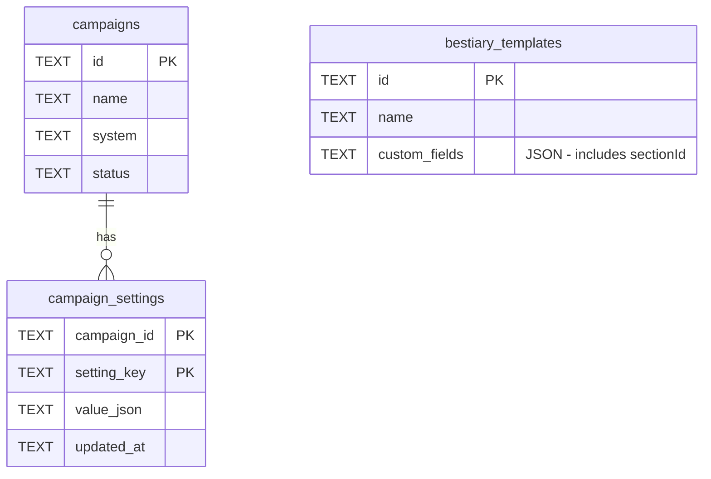

# feat: Settings Panel Sidebar Layout and Creature Form Builder

## Overview

Two related changes:

1. **Redesign the Campaign Settings panel** — switch from horizontal tabs to a vertical sidebar navigation (left: tab list, right: content). Make the modal nearly full-screen height and ~1/3 screen width.
2. **Add a Creature Form Builder tab** — users configure which sections and fields appear in the bestiary creature form. Sections can be toggled on/off, fields within sections can be shown/hidden and reordered. User-added fields also supported. The saved configuration drives `CreatureForm.tsx` in both the Bestiary and EncounterSets tools.

## Problem Statement

The creature form in the bestiary is hardcoded to D&D 5e fields. GMs running other systems (Pathfinder 2e, OSR, FATE, homebrew) can't customize which stats appear. The current settings panel is too small and uses horizontal tabs that won't scale to many settings sections. A sidebar layout provides room for growth.

## Proposed Solution

### Layout Redesign

Replace the horizontal Radix Tabs with a vertical sidebar layout inside the existing `<Modal>`:

```
┌─────────────────────────────────────────┐
│ Campaign Settings                    [X] │
├────────────┬────────────────────────────┤
│  Main      │                            │
│  Segments  │   (active tab content)     │
│  Creature  │                            │
│  Form      │                            │
│  Instruct. │                            │
│  Technical │                            │
│            │                            │
│            │                            │
├────────────┴────────────────────────────┤
│                              [Cancel] [Save] │ (footer only for tabs that need it)
└─────────────────────────────────────────┘
```

- Modal width: `min(90vw, 700px)` → content area still fits comfortably
- Modal height: `85vh` (nearly full screen)
- Left sidebar: ~180px fixed, vertical tab triggers
- Right area: flex-grow, scrollable content

### Creature Form Builder

A config editor that lets users define the creature form structure:

**Architecture decision: View Filter pattern.** The config is a *visibility and ordering layer* — it controls what is shown and in what order, but never deletes creature data. Disabling a field hides it from the form; re-enabling it brings back any existing data. This is safe and reversible.

**Built-in fields** (from `CreatureTemplate` typed properties) can be:
- Shown/hidden per section
- Reordered within their section

**Built-in fields cannot** be renamed or have their type changed. This keeps type safety intact.

**User-added fields** are stored in `CreatureTemplate.customFields[]` with a `sectionId` annotation to place them in specific sections. Available types for v1: `text` and `number`.

**Config scope: per-campaign** — different campaigns can have different creature form layouts (D&D 5e vs Pathfinder 2e).

## Technical Approach

### Architecture

#### Config Data Model

```typescript
// src/ui/canvas/CampaignSettings/creatureFormConfig.ts

interface FieldConfig {
  /** Field key — matches CreatureTemplate property name for built-in fields,
   *  or a custom key for user-added fields */
  key: string;
  /** Display label */
  label: string;
  /** Field type */
  type: 'text' | 'number' | 'select' | 'textarea' | 'ability-grid' | 'action-list' | 'trait-list';
  /** Is this a built-in field (cannot be deleted, only hidden) */
  builtIn: boolean;
  /** Visible in the form */
  visible: boolean;
  /** Sort order within section */
  order: number;
}

interface SectionConfig {
  /** Section key — e.g. 'basic', 'abilityScores', 'actions' */
  key: string;
  /** Display label */
  label: string;
  /** Section visible */
  visible: boolean;
  /** Sort order of the section */
  order: number;
  /** Fields in this section */
  fields: FieldConfig[];
}

interface CreatureFormConfig {
  sections: SectionConfig[];
}
```

#### Default Config

A `DEFAULT_CREATURE_FORM_CONFIG` constant mirrors the current hardcoded form layout — all sections visible, all fields visible, in the current order. When no saved config exists for a campaign, this default is used.

#### Persistence

New SQLite table `campaign_settings`:

```sql
CREATE TABLE IF NOT EXISTS campaign_settings (
  campaign_id TEXT NOT NULL,
  setting_key TEXT NOT NULL,
  value_json  TEXT NOT NULL,
  updated_at  TEXT NOT NULL,
  PRIMARY KEY (campaign_id, setting_key)
);
```

Config saved as `setting_key = 'creature_form_config'`, `value_json` = serialized `CreatureFormConfig`.

New IPC channels:
- `settings:load` → `(campaignId, settingKey) => string | null`
- `settings:save` → `(campaignId, settingKey, valueJson) => { ok: boolean }`

#### Data-Driven CreatureForm

`CreatureForm.tsx` currently renders hardcoded JSX sections. It must become data-driven:

1. Accept a `formConfig: CreatureFormConfig` prop
2. Iterate `config.sections.filter(s => s.visible).sort(...)` to render sections
3. Within each section, render `fields.filter(f => f.visible).sort(...)` 
4. Built-in fields render their typed input (number input for HP, select for creature type, etc.)
5. User-added fields render generic text/number inputs, storing values in `customFields[]`

The `InstanceForm.tsx` in EncounterSets should also receive the same config — both tools read it from the same persisted source.

### Implementation Phases

#### Phase 1: Settings Panel Sidebar Layout

**Goal:** Redesign CampaignSettings from horizontal tabs to vertical sidebar layout.

**Tasks:**
- Refactor `CampaignSettings.tsx` — change Radix Tabs orientation to vertical
- Update `CampaignSettings.module.css` — sidebar grid layout, `85vh` height, `min(90vw, 700px)` width
- Rename "Segments" tab to keep, add "Creature Form" tab (placeholder initially)
- Verify existing MainSettingsTab still works in the new layout

**Files:**
- `src/ui/canvas/CampaignSettings/CampaignSettings.tsx`
- `src/ui/canvas/CampaignSettings/CampaignSettings.module.css`

**Success criteria:** Settings opens with sidebar nav, all existing tabs work, modal is larger.

#### Phase 2: Persistence Layer

**Goal:** Add `campaign_settings` table and IPC for generic key-value campaign settings.

**Tasks:**
- Add `campaign_settings` table to `database.ts` `initDb()`
- Add `loadCampaignSetting()` and `saveCampaignSetting()` to `database.ts`
- Add IPC handlers in `main.ts`
- Expose in `preload.ts`
- Add type declarations in `electron.d.ts`

**Files:**
- `src/electron/database.ts`
- `src/electron/main.ts`
- `src/electron/preload.ts`
- `src/ui/electron.d.ts`

**Success criteria:** Settings can be saved and loaded per campaign via IPC.

#### Phase 3: Creature Form Config Types and Defaults

**Goal:** Define the config data model and default configuration.

**Tasks:**
- Create `creatureFormConfig.ts` with interfaces and `DEFAULT_CREATURE_FORM_CONFIG`
- Default config should exactly match current hardcoded CreatureForm layout
- Add a `useCreatureFormConfig` hook that loads config from IPC on mount, falls back to default

**Files:**
- `src/ui/canvas/CampaignSettings/creatureFormConfig.ts` (new)
- `src/ui/canvas/CampaignSettings/hooks/useCreatureFormConfig.ts` (new)

**Success criteria:** Hook returns config for a campaign, defaulting to hardcoded layout.

#### Phase 4: Creature Form Builder UI

**Goal:** Build the settings tab where users configure the form.

**Tasks:**
- Create `CreatureFormTab.tsx` — renders section list with toggles, expandable field lists
- Each section: toggle visible, drag handle for reorder
- Each field within section: toggle visible, drag handle for reorder
- "Add Field" button per section — opens inline form for name + type (text/number)
- "Remove" button on user-added fields (built-in fields only have hide toggle)
- Save button persists to SQLite via the hook

**Files:**
- `src/ui/canvas/CampaignSettings/CreatureFormTab.tsx` (new)
- `src/ui/canvas/CampaignSettings/CreatureFormTab.module.css` (new)

**Success criteria:** User can toggle sections/fields, reorder them, add custom fields, and save.

#### Phase 5: Data-Driven CreatureForm

**Goal:** Make the bestiary form render based on config instead of hardcoded JSX.

**Tasks:**
- Refactor `CreatureForm.tsx` to accept `formConfig` prop
- Render sections and fields dynamically based on config
- Built-in field types keep their current specialized inputs
- User-added fields render as generic text/number inputs, storing in `customFields[]` with `sectionId`
- Load config in `Bestiary.tsx` and `EncounterSets.tsx`, pass to forms
- `InstanceForm.tsx` also receives config

**Files:**
- `src/ui/tools/bestiary/components/CreatureForm.tsx` (major refactor)
- `src/ui/tools/bestiary/components/InstanceForm.tsx` (update)
- `src/ui/tools/bestiary/Bestiary.tsx` (load config, pass prop)
- `src/ui/tools/bestiary/EncounterSets.tsx` (load config, pass prop)
- `src/ui/tools/bestiary/types.ts` (extend `CustomField` with `sectionId`)

**Success criteria:** Form reflects saved config. Disabling a section hides it. Reordering changes display order. Custom fields appear in their assigned section.

#### Phase 6: Polish

**Goal:** Edge cases and UX refinement.

**Tasks:**
- "Reset to Defaults" button in creature form builder
- Validate no duplicate field keys when adding custom fields
- Section reordering (drag sections to change section order)
- Ensure EncounterSets instance form respects config

**Success criteria:** No data loss, smooth UX, reset works.

## Alternative Approaches Considered

1. **Schema definition (destructive)** — removing a field deletes data from creatures. Rejected: too risky, irreversible, requires migration logic.
2. **Global config** — one form config for the whole app. Rejected: different campaigns may use different RPG systems.
3. **Full drawer/panel instead of modal** — replacing `<Modal>` entirely. Rejected: modal is already well-integrated, just needs size override. Keep the Radix Dialog wrapper for accessibility (focus trap, escape, overlay).
4. **Separate config per tool** — bestiary and encounter sets each have their own config. Rejected: they should share one creature form definition.

## System-Wide Impact

### Interaction Graph

Settings panel save → `electronAPI.settings.save()` → `database.ts saveCampaignSetting()` → SQLite `campaign_settings` row upsert + `persist()`.

Bestiary/EncounterSets tool opens → `useCreatureFormConfig(campaignId)` → `electronAPI.settings.load()` → `database.ts loadCampaignSetting()` → config returned → `CreatureForm` renders dynamically.

### Error & Failure Propagation

- Settings save failure: IPC returns `null` → show error in settings UI, don't close modal
- Config load failure: hook falls back to `DEFAULT_CREATURE_FORM_CONFIG` → form always renders, never broken
- Invalid/corrupt config JSON: `JSON.parse` in hook with try/catch → fallback to default

### State Lifecycle Risks

- **No orphaned data** — view filter pattern means creature data is never deleted by config changes
- **Config vs creature data mismatch** — custom fields in config may reference `customFields[]` entries that don't exist on older creatures → form renders empty input, user fills if desired
- **Campaign deletion** — existing `deleteCampaign` should cascade to `campaign_settings` (add `ON DELETE CASCADE` or manual cleanup)

### API Surface Parity

- `CreatureForm.tsx` and `InstanceForm.tsx` both need the config prop — share the same `useCreatureFormConfig` hook
- `ElectronAPI` gets new `settings` namespace alongside existing `canvas`, `campaigns`, `bestiary`

### Integration Test Scenarios

1. Save config with section disabled → open bestiary → create creature → disabled section not shown → re-enable section in settings → open creature → section visible with empty fields
2. Add custom field "Alignment" to Basic section → save → create creature → fill "Alignment" → save creature → verify `customFields` contains `{key: "alignment", value: "Chaotic Evil", sectionId: "basic"}`
3. Reorder fields in Basic → save → open existing creature → fields render in new order, data intact
4. Delete campaign → verify `campaign_settings` rows are also removed
5. Load bestiary with no saved config → form renders exactly like the current hardcoded layout

## Acceptance Criteria

### Functional Requirements

- [ ] Settings panel has vertical sidebar navigation (left: tabs, right: content)
- [ ] Modal is ~85vh height and min(90vw, 700px) width
- [ ] "Creature Form" tab appears in sidebar navigation
- [ ] Sections can be toggled visible/hidden with toggle switches
- [ ] Fields within sections can be toggled visible/hidden
- [ ] Fields within sections can be reordered (drag & drop or up/down buttons)
- [ ] Sections can be reordered
- [ ] User can add custom fields (text/number type) to any section
- [ ] User can remove custom fields (but not built-in fields)
- [ ] "Reset to Defaults" restores original layout
- [ ] Config persists per campaign in SQLite
- [ ] `CreatureForm` renders dynamically based on saved config
- [ ] `InstanceForm` also respects the config
- [ ] Disabling a field preserves existing creature data (view filter pattern)
- [ ] Re-enabling a field shows previously saved data

### Non-Functional Requirements

- [ ] No performance regression in bestiary with config loading
- [ ] Config loads from SQLite in <50ms
- [ ] Form builder responsive within the modal width

### Quality Gates

- [ ] `npm run build` passes
- [ ] `npm run lint` passes (no new errors)
- [ ] Existing bestiary functionality unchanged when no config is saved (default matches current behavior)

## Success Metrics

- User can configure creature form layout without touching code
- Different campaigns can have different creature schemas
- Existing creatures don't lose data when form is reconfigured

## Dependencies & Prerequisites

- Existing `<Modal>` component (Radix Dialog wrapper)
- Existing `@radix-ui/react-tabs` (already installed)
- Existing `CreatureForm.tsx` with hardcoded sections (will be refactored)
- Campaign settings IPC (to be built in Phase 2)

## Risk Analysis & Mitigation

| Risk | Impact | Mitigation |
|------|--------|------------|
| CreatureForm refactor breaks existing functionality | High | Default config matches current hardcoded layout exactly — zero behavioral change when no config is saved |
| Drag & drop reordering complex in modal | Medium | Start with up/down arrow buttons, add drag later as polish |
| Config schema evolution | Low | Version field in config JSON; migration logic if schema changes |
| Custom field collision with built-in keys | Low | Validate unique keys on add; prefix custom keys internally |

## Future Considerations

- **Import/export configs** — share creature form layouts between campaigns or users
- **Field type expansion** — select dropdowns (with option lists), boolean toggles, rich text
- **Template presets** — ship with "D&D 5e", "Pathfinder 2e", "OSR" form presets
- **More settings tabs** — the sidebar layout accommodates many future settings categories

## Documentation Plan

- Update `docs/brainstorms/tutorial.md` with creature form config architecture
- Document the `campaign_settings` table schema
- Document the `CreatureFormConfig` interface for future developers

## Sources & References

### Internal References

- Current creature form: `src/ui/tools/bestiary/components/CreatureForm.tsx`
- Instance form: `src/ui/tools/bestiary/components/InstanceForm.tsx`
- Bestiary types: `src/ui/tools/bestiary/types.ts`
- Settings panel: `src/ui/canvas/CampaignSettings/CampaignSettings.tsx`
- Modal component: `src/ui/components/Modal/Modal.tsx`
- Database layer: `src/electron/database.ts`
- Bestiary requirements: `docs/brainstorms/2026-05-15-bestiary-requirements.md`

### Related Work

- Campaign settings panel plan: `docs/plans/2026-05-16-001-feat-campaign-settings-panel-plan.md`


